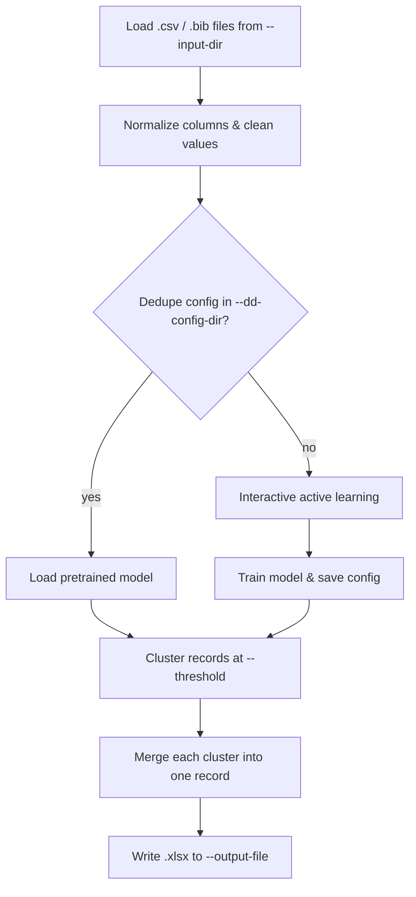

# CLI reference

The `deduplicate` command is a single Click command
(`mapwisefox.deduplication.__main__.main`, exposed as `deduplicate` via
`[project.scripts]`).

```bash
uv run deduplicate --help
```

## Options

| Option | Default | Description |
|---|---|---|
| `--input-dir`, `-I` | `./data/input` | Directory containing `.csv`/`.bib` files to merge & deduplicate (searched non-recursively). |
| `--output-file`, `-o` | `./data/output/<timestamp>-deduplicated-records.xlsx` | Path the merged `.xlsx` is written to (parent directory created if missing). The default timestamp is computed at run time, so it's different on every invocation. |
| `--dd-config-dir` | `./dedupe` | Directory holding the reusable dedupe config (`training.json` + `settings.dedupe`) — loaded if present, generated via interactive labeling and saved there otherwise. |
| `--threshold` | `0.5` | Similarity score (0–1) above which two records are treated as duplicates. See [How it works](../how-it-works.md#threshold-and-clustering). |
| `--field`, `-f` | `title`, `authors`, `keywords`, `doi`, `source` | One or more string fields to deduplicate on. Repeat the flag to select specific fields; when omitted, the built-in default field set is used. |

If `--input-dir` doesn't exist, or exists but contains no `.csv`/`.bib`
files, `deduplicate` exits with a clear error instead of failing deep inside
the matching engine.

## Execution model



Errors in loading input files (e.g. an unreadable `.csv`) are not caught —
they propagate and stop the run, since a partial or malformed dataset would
silently corrupt the matching step.
