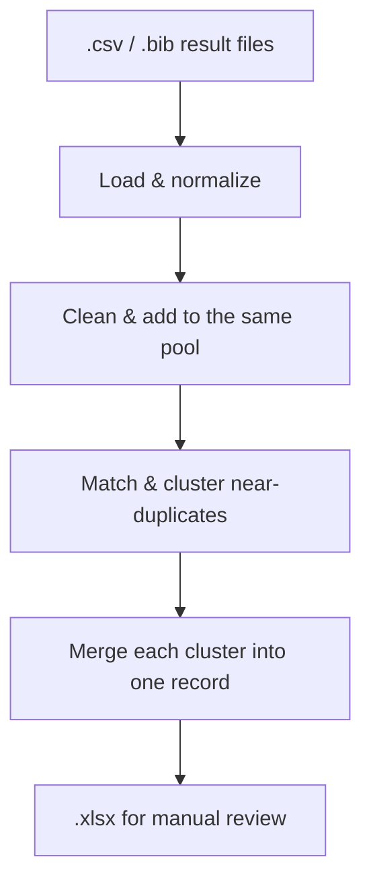

# Deduplication

Running the same review query against several databases (via [`search`](../search/index.md)
or by hand) means the same paper often comes back more than once — once from
ACM, once from Scopus, once from a manual Web of Science export, each with
slightly different metadata. The `deduplicate` command takes every result file
you point it at, merges them into one pool, finds the near-duplicate records,
and produces a single spreadsheet with one row per unique study.

## Rationale

It doesn't matter whether a result file came from `search`, a live vendor API,
or a spreadsheet you exported by hand from a database's own web UI — as long
as it has the right structure, `deduplicate` treats it the same way. The tool
normalizes everything to the same internal data model, places all records in
the same combined pool, then deduplicates the combined pool, so you get one
merged, reviewable list instead of manually cross-checking titles across
several spreadsheets.

## Where to go next

- Start with **[Usage](getting-started/usage.md)**.
- See **[CLI reference](getting-started/cli-reference.md)** for how to invoke the command and available flags.
- See **[How it works](how-it-works.md)** for a more in-depth explanation of the process.
