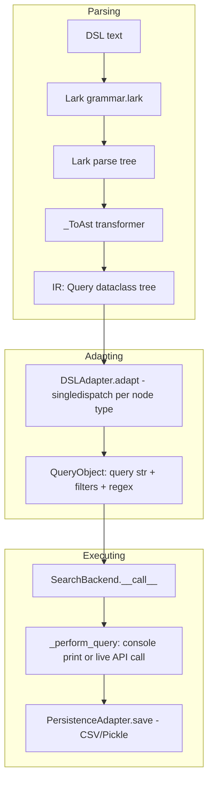

# Overview

## Layers

1. **Parser** (`dsl/parser/`) — `grammar.lark` + `_parser.py` +
   `_ir.py`. Pure syntax: turns DSL text into a typed AST with no knowledge of
   any specific vendor. See [IR](ir.md).
2. **Adapters** (`dsl/adapters/`) — one `DSLAdapter` subclass per vendor.
   Walks the IR and emits vendor-native query strings/filters/regex. This is
   where all vendor-specific knowledge lives. See [Adapters](adapters.md),
   [Field mapping](field-mapping.md), and
   [Regex handling](regex-handling.md).
3. **Backends** (`backends/`) — one `SearchBackend` subclass per vendor.
   Takes the `QueryObject` an adapter produced and either prints it (console
   backends, for vendors without a query API) or calls the vendor's HTTP API
   and persists results. See [Backends](../backends/overview.md).

## The `QueryObject` contract

Every adapter, regardless of vendor, must ultimately produce a
[`QueryObject`](query-object.md) — the single data structure backends know how
to consume. This is the seam that lets parsing, adapting, and executing be
developed and tested independently: the parser doesn't know adapters exist,
adapters don't know backends exist, and backends don't know (or care) how a
`QueryObject` was built.

## Extension points

- **New DSL syntax** → touches `grammar.lark`, `_ir.py`, `_parser.py`, and
  potentially every adapter's `emit_*` methods.
- **New vendor, existing DSL features** → touches only `dsl/adapters/` (one
  new `DSLAdapter` subclass) and `backends/` (one new `SearchBackend`
  subclass). See the recipe in [Adapters](adapters.md).
- **New backend option/behavior** (e.g. a new persistence format) → touches
  only `backends/` and/or `persistence/`.
