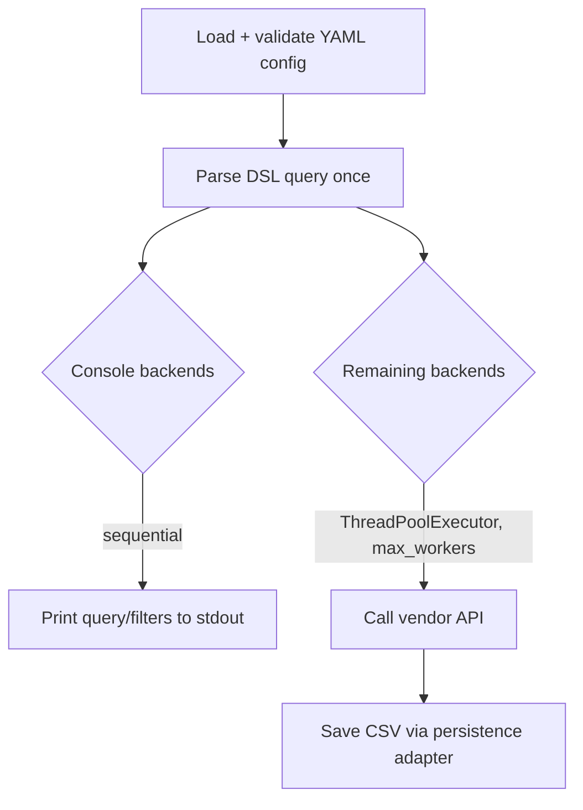

# CLI reference

The `search` command is a single Click command
(`mapwisefox.search.__main__.main`, exposed as `search` via
`[project.scripts]`).

```bash
uv run search --help
```

## Options

| Option | Env var | Default | Description |
|---|---|---|---|
| `--config`, `-c` (required) | `MWF_SEARCH_CONFIG` | — | Path to the YAML search configuration file. |
| `--data-dir`, `-D` | `DATA_DIR` | `./data` | Root directory results are written under. |
| `--max-workers` | — | `3` | Maximum number of backends to run concurrently (applies only to non-console backends). |
| `--debug`, `-d` | — | `False` | Print detailed errors from all backends, and log per-backend error tracebacks after a run. |
| `--enable-weekly-bucket` | — | `False` | Add a `<YYYYMMDD of most recent Monday>` subdirectory under `--results-dir-name` where results are written. |
| `--results-dir-name` | — | `search-results` | Subdirectory name within `--data-dir` where results are written. |

## Execution model



Console backends always run first and strictly sequentially, so their
printed output never interleaves with logging from concurrent backends.
A backend counts as "console" if it uses `ConsoleBackend`, or if it's
`WebOfScienceBackend` configured with `use_starter_api: false` (see
[Web of Science](../backends/web-of-science.md)).

Errors in any single backend are caught, logged, and don't stop the others
from running; with `--debug`, tracebacks for failed backends are printed
after the run completes.
