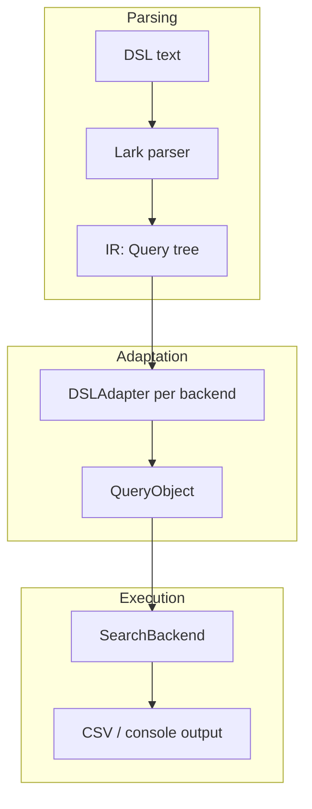

# Search

The `search` command lets you write **one query** in a small custom DSL and run
it against several academic search APIs/UIs. Each backend gets its own
adapter that translates the shared DSL into that vendor's native query syntax,
so you stop hand-translating boolean search strings between five different
query languages every time you kick off a review.

## Rationale

Systematic reviews often require running the same logical query against many
databases, each having incompatible query syntax, field names, and filter
mechanisms (e.g., varying support for server-side title/abstract filters;
using `AND`/`OR` vs. `&`/`|`; different date range formats). Keeping translated
queries in sync with a single source of truth doesn't scale, making mismatches
across databases easy to introduce. These mismatches eventually need explaining
(or apologizing for) in a PRISMA diagram. While the `search` CLI cannot fix
feature mismatches between search backends, it provides deterministic, predictable
graceful failover mechanisms and simplifies making one change across all backends.

## Where to go next

- New here? Start with **[Installation](getting-started/installation.md)**
  and **[Usage](getting-started/usage.md)**.
- Want to write a query? Read the **[DSL](dsl/overview.md)** section.
- Adding a new backend or debugging an adapter? See
  **[Architecture](architecture/overview.md)**.
- Looking for the old query-construction API? It's
  **[deprecated](legacy/query-builder.md)** — use the DSL instead.
