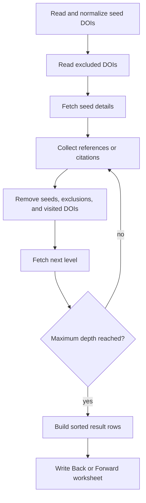

# CLI reference

The `snowball` command is an AsyncClick command
(`mapwisefox.snowballing.run_command`, exposed as `snowball` through
`[project.scripts]`).

```bash
uv run snowball --help
```

Its command shape is:

```text
snowball [OPTIONS] INPUT_FILE
```

`INPUT_FILE` must be an existing, readable Excel workbook. Unless
`--sheet-name` is provided, the first worksheet supplies the seed DOIs.

## Options

| Option                                | Default                 | Description                                                                       |
| ------------------------------------- | ----------------------- | --------------------------------------------------------------------------------- |
| `INPUT_FILE`                          | Required                | Excel workbook containing the seed papers.                                        |
| `--exclude SHEET`, `-e SHEET`         | None                    | Worksheet in `INPUT_FILE` containing DOIs that must not be returned or traversed. |
| `--sheet-name SHEET`, `-s SHEET`      | First worksheet         | Worksheet containing the seed DOIs.                                               |
| `--id-column-name COLUMN`             | `doi`                   | DOI column used in both the seed and exclusion worksheets.                        |
| `--output-prefix PREFIX`, `-o PREFIX` | Input filename stem     | Prefix for `<prefix>-snowball.xlsx`, written beside the input workbook.           |
| `--in-place`                          | Off                     | Add the result worksheet to `INPUT_FILE` instead of creating a separate workbook. |
| `--direction forward\|backward`       | `backward`              | Follow citations for forward snowballing or references for backward snowballing.  |
| `--max-depth INTEGER`                 | `1`                     | Number of citation levels to traverse. Must be at least `1`.                      |
| `--linked-ids-column COLUMN`          | `referencing_paper_ids` | Name of the output column containing directly linked paper DOIs.                  |

`--output-prefix` has no effect with `--in-place`. The linked-IDs column cannot
use one of the built-in output column names, such as `doi` or `title`.

The package can also be invoked through its module entry point:

```bash
uv run python -m mapwisefox.snowballing INPUT_FILE
```

## Common variations

Follow papers that cite the seeds and continue for two levels:

```bash
uv run snowball papers.xlsx --direction forward --max-depth 2
```

Use custom worksheet and column names:

```bash
uv run snowball review.xlsx \
  --sheet-name Included \
  --exclude Excluded \
  --id-column-name paper_id
```

Write the result into the source workbook:

```bash
uv run snowball review.xlsx --in-place
```

Generate both directions in the default output workbook:

```bash
uv run snowball papers.xlsx --direction backward
uv run snowball papers.xlsx --direction forward
```

The first command creates `papers-snowball.xlsx` with a `Back` worksheet. The
second preserves that worksheet and adds a `Forward` worksheet. Repeating a
direction replaces its existing result worksheet without prompting.

## Real-world: both directions in place with exclusions

When the seed worksheet already lives inside a workbook you want to keep
extending, run both directions `--in-place` and use `-e` to exclude the DOIs
discovered by the opposite direction so the two result sets stay disjoint:

```bash
uv run snowball review.xlsx --in-place \
  --direction backward \
  --sheet-name primary-selection

uv run snowball review.xlsx --in-place \
  -e Back \
  --direction forward \
  --sheet-name primary-selection
```

The first run writes a `Back` worksheet into `review.xlsx`. The second run
writes a `Forward` worksheet into the same workbook while skipping any DOI that
already appears in the `Back` worksheet. This mirrors the workflow used in the
`data/slr-oss` example.

## Execution model



## Errors and warnings

| Situation                                         | Behavior                                                                 |
| ------------------------------------------------- | ------------------------------------------------------------------------ |
| Input file does not exist or is unreadable        | CLI argument is rejected before execution.                               |
| Worksheet does not exist                          | Exit with an Excel worksheet error.                                      |
| DOI column does not exist                         | Exit with `Column '<name>' was not found`.                               |
| Direction is invalid or depth is less than `1`    | Report a usage error.                                                    |
| Linked-IDs column conflicts with an output column | Exit before contacting Semantic Scholar.                                 |
| Semantic Scholar does not return some seed DOIs   | A warning reports the count and processing continues.                    |
| No related papers are found                       | The command succeeds and writes an empty worksheet with the full schema. |
| Network, API, workbook, or write operation fails  | The error stops the run; no partial-result recovery is attempted.        |

Semantic Scholar may omit papers, relationships, or metadata. Relations without
a DOI cannot participate in this DOI-based traversal.
