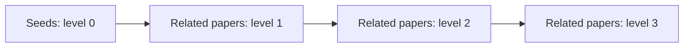

# How it works

`snowball` performs a breadth-first traversal of the DOI citation graph exposed
by Semantic Scholar. This page describes the traversal and workbook behavior;
the [Semantic Scholar API documentation](https://api.semanticscholar.org/api-docs/)
is the reference for the underlying data source.

## Input preparation

The command reads the configured DOI column from the seed worksheet and,
optionally, an exclusion worksheet in the same workbook. Values are normalized
before any API request:

1. Missing values are discarded.
2. Surrounding whitespace is removed and letters are lowercased.
3. Common `doi:` and `doi.org` URL prefixes are removed.
4. Duplicate values collapse into one DOI.

Normalization does not validate DOI syntax. Any remaining non-empty string is
treated as an identifier and may simply produce no Semantic Scholar result.

## Direction

| Direction  | Relationship followed              | Result worksheet |
| ---------- | ---------------------------------- | ---------------- |
| `backward` | References listed by each paper    | `Back`           |
| `forward`  | Papers listed as citing each paper | `Forward`        |

For either direction, the linked-IDs column records the DOI from the preceding
level that led to a result. When several papers link to the same DOI, all of
their IDs are retained, sorted, and separated with semicolons.

## Breadth-first traversal

The seed papers (search results or manual seeds) form level zero. All unseen
papers directly linked from the current level are fetched together to form the
next level. This repeats until `--max-depth` levels have been fetched.

With `--max-depth 1`, only level 1 is returned. With `--max-depth 2`, levels 1
and 2 are returned. Seed papers are not output as discoveries, even if the citation
graph links back to them.

The traversal keeps a visited DOI set. A DOI is fetched at most once, which
prevents cycles and repeated requests when several papers lead to the same
result. Papers are marked visited when requested; if Semantic Scholar omits one,
it is not retried at a later level.

## Exclusions

Excluded DOIs enter the visited set before traversal starts. They are not
fetched as discoveries, included in the output, or expanded at a later depth.
They are also removed from the linked IDs recorded for other papers.

Exclusions apply only to the current run. The command does not modify the seed
or exclusion worksheets.

## Semantic Scholar records

Snowballing requests paper details and citation relationships through the
[`meta-paper`](https://github.com/koosie0507/meta-paper) Semantic Scholar
adapter. Only papers and relationships with a DOI can be represented. A paper
may also have missing title, abstract, source, year, or PDF metadata depending
on Semantic Scholar's coverage. Semantic Scholar lacks author keywords coverage.

Requests use a 30-second overall HTTP timeout and a 2-second connection timeout.
Network failures and API errors stop the run. Larger depths can expand the
frontier quickly, increasing runtime and the chance of API rate limiting.

Because Semantic Scholar's graph and metadata change over time, repeating the
same command is not guaranteed to produce byte-for-byte identical output.

## Building the workbook

Fetched papers are keyed and sorted by normalized DOI before being converted to
rows. Authors and directly linked DOIs are represented as semicolon-separated
strings, and each paper URL is written as `https://doi.org/<doi>`.

Unless `--in-place` is set, the destination is
`<input-stem>-snowball.xlsx` beside the input file. `--output-prefix` replaces
the input stem, not the `-snowball.xlsx` suffix.

When the destination already exists, Snowballing preserves its other worksheets
and replaces only `Back` or `Forward`, according to the current direction. With
`--in-place`, the same rule preserves the original workbook's input and
unrelated worksheets.

The `cluster_id` column is the zero-based DataFrame index written to Excel. It
does not identify a citation cluster and should not be treated as a stable paper
identifier; use `doi` for that purpose.
