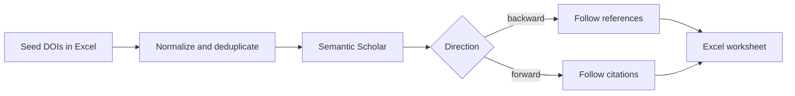

# Snowballing

Database searches rarely find every relevant study. Citation snowballing expands
an existing set of papers (not necessarily resulted from a search) by following
their references (backward snowballing) or finding papers that cite them
(forward snowballing). The `snowball` command reads seed DOIs from an Excel
workbook, retrieves citation data from [Semantic Scholar](https://semanticscholar.org),
and writes the discovered papers to another workbook.

## Rationale

Snowballing complements the database queries produced by
[`search`](../search/index.md). A review can begin with known studies or a
screened search result. Snowballing expands that set through the citation
graph. The newly discovered records are typically passed to
[`deduplicate`](../deduplication/index.md) a second time before screening.
The `snowball` CLI also provides an exclusion filter, potentially removing
the need for this second deduplication step.

The traversal of the citation tree is DOI-based. Seed papers, excluded
papers, and already visited papers are not returned as new results, so the
output contains only **new** papers discovered during the run.

## Next Steps

- Start with the testable **[Usage](getting-started/usage.md)** workflow.
- See the **[CLI reference](getting-started/cli-reference.md)** for every option.
- See **[How it works](how-it-works.md)** for traversal and output details.
